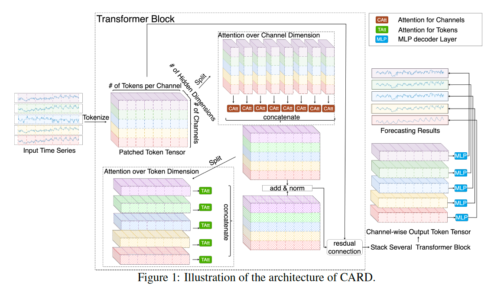
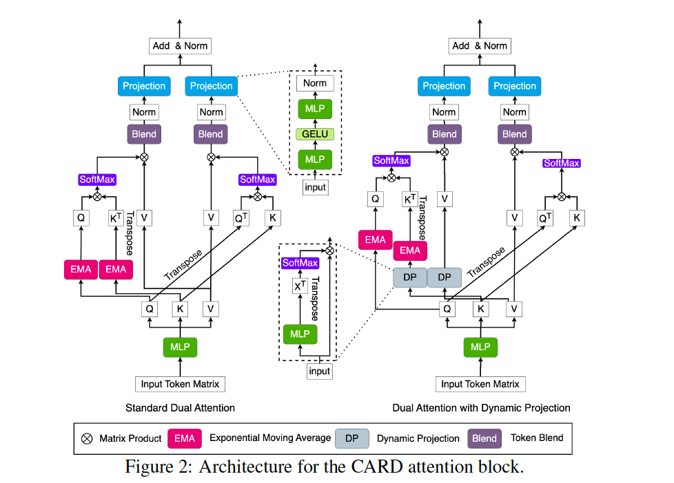
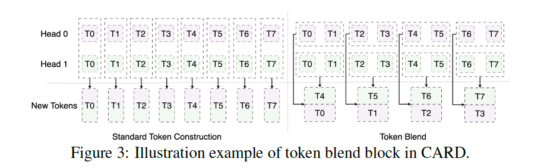
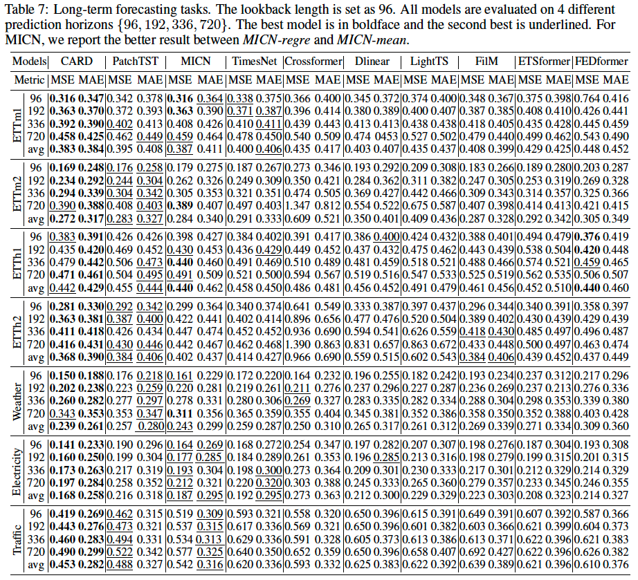

# (ICLR'24) CARD: Channel Aligned Robust Blend Transformer for Time Series Forecasting

This Official repository contains PyTorch codes for CARD: Channel Aligned Robust Blend Transformer for Time Series Forecasting [paper](https://arxiv.org/abs/2305.12095).

## Citing CARD
> 🌟 If you find this resource helpful, please consider to star this repository and cite our research:

```tex
@inproceedings{xue2024card,
  title={CARD: Channel Aligned Robust Blend Transformer for Time Series Forecasting},
  author={Xue, Wang and Zhou, Tian and Wen, QingSong and Gao, Jinyang and Ding, Bolin and Jin, Rong},
  booktitle={International Conference on Learning Representations (ICLR)},
  year={2024}
}
```
In case of any questions, bugs, suggestions or improvements, please feel free to open an issue.


## Designs

**Channel Alignment**: Allow information to be shared among different channels/covariates.

**Dual Attention**: Explore the within-patch information.

**Token Blend**: Utilize mutli-scale knowledge.
<p align="center">
<!--  -->

</p>

<p align="center">
<!--  -->


</p>
<!--  -->
<!--  -->

## Main Results




## Get Started

1. Dataset can be obtained from Time Series Library (TSlib) at <https://github.com/thuml/Time-Series-Library/tree/main> 

2. The code for long-term forecasting experiment in section 5.1 is in folder `long_term_forecast_l96`. We provide the experiment scripts of all benchmarks under the folder `long_term_forecast_l96/scripts/CARD`. You can reproduce the multivariate experiments by running the following shell scripts:

```
cd long_term_forecast_l96
bash scripts/CARD/ETT.sh 
bash scripts/CARD/wEATHER.sh 
bash scripts/CARD/ECL.sh 
bash scripts/CARD/Traffic.sh 
```

3. The code for long-term forecasting experiment in Appendix E is in folder `long_term_forecast_l720`. We provide the experiment scripts of all benchmarks under the folder `long_term_forecast_l720/scripts/CARD`. You can reproduce the multivariate experiments by running the following shell scripts:

```
cd long_term_forecast_l720
bash scripts/CARD/ettm1.sh
bash scripts/CARD/ettm2.sh
bash scripts/CARD/etth1.sh
bash scripts/CARD/etth2.sh
bash scripts/CARD/weather.sh
bash scripts/CARD/electricity.sh
bash scripts/CARD/traffic.sh
```


4. The code for short-term M4 forecasting experiment in section 5.2 is in folder `short_term_forecast_m4`. We provide the experiment scripts of all benchmarks under the folder `short_term_forecast_m4/scripts/CARD`. You can reproduce the multivariate experiments by running the following shell scripts:

```
cd short_term_forecast_m4
bash scripts/CARD_M4.sh 
```

## Acknowledgement

We appreciate the following github repo very much for the valuable code base:

https://github.com/yuqinie98/PatchTST
https://github.com/thuml/Time-Series-Library


## Contact

If you have any questions or concerns, please contact us: xue.w@alibaba-inc.com or tian.zt@alibaba-inc.com


## Further Reading
1, [**Transformers in Time Series: A Survey**](https://arxiv.org/abs/2202.07125), in IJCAI 2023.
[\[GitHub Repo\]](https://github.com/qingsongedu/time-series-transformers-review)

```bibtex
@inproceedings{wen2023transformers,
  title={Transformers in time series: A survey},
  author={Wen, Qingsong and Zhou, Tian and Zhang, Chaoli and Chen, Weiqi and Ma, Ziqing and Yan, Junchi and Sun, Liang},
  booktitle={International Joint Conference on Artificial Intelligence(IJCAI)},
  year={2023}
}
```


